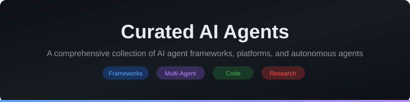

# Curated AI Agents

  

  <strong>A comprehensive, community-driven collection of AI agent frameworks, platforms, and ready-to-use autonomous agents.</strong>

  
  
  
  

---

AI agents are autonomous software systems powered by large language models (LLMs) that can perceive their environment, make decisions, and take actions to accomplish goals. Unlike simple chatbots, agents can use tools, chain reasoning steps, collaborate with other agents, and operate with varying degrees of autonomy. This list curates the best frameworks, platforms, and tools in the rapidly evolving AI agent ecosystem.

## Contents

- [Featured](#featured)
- [Agent Frameworks](#agent-frameworks)
- [Multi-Agent Platforms](#multi-agent-platforms)
- [Code Agents](#code-agents)
- [Research Agents](#research-agents)
- [Browser Agents](#browser-agents)
- [Task Automation](#task-automation)
- [Agent SDKs & Libraries](#agent-sdks--libraries)
- [Agent Monitoring & Evaluation](#agent-monitoring--evaluation)
- [Recently Added](#recently-added)
- [Related Lists](#related-lists)
- [Contributing](#contributing)

## Featured

> **Ssemble AI Clipping** - Create AI-powered short-form video clips from YouTube videos. Provides 9 MCP tools for creating shorts, browsing caption templates, background music, gameplay overlays, and meme hooks. Automate your content repurposing workflow with intelligent AI clipping.
>
> **[npm package](https://www.npmjs.com/package/@ssemble/mcp-server)** | **[Website](https://www.ssemble.com)**

## Agent Frameworks

General-purpose frameworks for building autonomous AI agents.

- **[AutoGPT](https://github.com/Significant-Gravitas/AutoGPT)** - An experimental open-source autonomous AI agent that can perform tasks with minimal human intervention using GPT-4 and GPT-3.5.
- **[CrewAI](https://github.com/crewAIInc/crewAI)** - Framework for orchestrating role-playing autonomous AI agents that work together to accomplish complex tasks.
- **[LangGraph](https://github.com/langchain-ai/langgraph)** - Library for building stateful, multi-actor applications with LLMs, used to create agent and multi-agent workflows.
- **[AutoGen](https://github.com/microsoft/autogen)** - Microsoft's framework for building multi-agent conversational AI systems with customizable and conversable agents.
- **[MetaGPT](https://github.com/geekan/MetaGPT)** - Multi-agent framework that assigns different roles to GPTs to form a collaborative software entity for complex tasks.
- **[BabyAGI](https://github.com/yoheinakajima/babyagi)** - An AI-powered task management system that uses OpenAI and vector databases to create, prioritize, and execute tasks autonomously.
- **[CAMEL](https://github.com/camel-ai/camel)** - Communicative Agents for "Mind" Exploration of Large Language Model Society, enabling cooperative multi-agent research.
- **[AgentGPT](https://github.com/reworkd/AgentGPT)** - Browser-based autonomous AI agent that can be configured and deployed to accomplish user-defined goals.
- **[SuperAGI](https://github.com/TransformerOptimus/SuperAGI)** - A developer-first open-source framework for building, managing, and running useful autonomous AI agents.
- **[Haystack](https://github.com/deepset-ai/haystack)** - Framework by deepset for building AI applications with agents, retrieval-augmented generation, and question answering.
- **[Phidata](https://github.com/phidatahq/phidata)** - Toolkit for building AI agents with memory, knowledge, and tools using function calling.
- **[OpenAI Agents SDK](https://github.com/openai/openai-agents-python)** - OpenAI's lightweight Python library for building multi-agent workflows with handoffs, guardrails, and tracing.
- **[Pydantic AI](https://github.com/pydantic/pydantic-ai)** - Agent framework for building production-grade applications with generative AI, built by the team behind Pydantic.
- **[Smolagents](https://github.com/huggingface/smolagents)** - Hugging Face's lightweight library for building powerful AI agents in a few lines of code with code-based actions.
- **[DSPy](https://github.com/stanfordnlp/dspy)** - Stanford's framework for algorithmically optimizing LM prompts and weights for building modular AI systems.

## Multi-Agent Platforms

Platforms designed for orchestrating multiple AI agents working together.

- **[CrewAI](https://github.com/crewAIInc/crewAI)** - Production-ready multi-agent orchestration platform where agents collaborate through role-based task delegation.
- **[AutoGen](https://github.com/microsoft/autogen)** - Microsoft's multi-agent conversation framework enabling complex inter-agent communication patterns.
- **[ChatDev](https://github.com/OpenBMB/ChatDev)** - Virtual software company powered by multiple intelligent agents filling different roles like CEO, CTO, programmer, and tester.
- **[AgentVerse](https://github.com/OpenBMB/AgentVerse)** - Platform for simulating and deploying multiple AI agents in collaborative or competitive environments.
- **[OpenHands](https://github.com/All-Hands-AI/OpenHands)** - Platform for AI software development agents that can write code, use terminals, and browse the web.
- **[Swarm](https://github.com/openai/swarm)** - OpenAI's educational framework for lightweight multi-agent orchestration demonstrating handoff and routine patterns.
- **[Magentic-One](https://github.com/microsoft/autogen/tree/main/python/packages/autogen-magentic-one)** - Microsoft's generalist multi-agent system for solving complex tasks across web and file-based environments.
- **[GPT Pilot](https://github.com/Pythagora-io/gpt-pilot)** - Multi-agent development tool that writes entire applications from scratch by guiding the user through the development process.
- **[Agency Swarm](https://github.com/VRSEN/agency-swarm)** - Framework for creating collaborative swarms of AI agents with distinct roles, enabling agent-to-agent communication.
- **[LangGraph Platform](https://github.com/langchain-ai/langgraph)** - Deploy and scale multi-agent systems as APIs with built-in state management, streaming, and human-in-the-loop support.
- **[Autogen Studio](https://github.com/microsoft/autogen)** - No-code interface for rapidly prototyping multi-agent workflows using Microsoft's AutoGen framework.

## Code Agents

AI agents specialized in software development, code generation, and debugging.

- **[SWE-agent](https://github.com/princeton-nlp/SWE-agent)** - Princeton's agent that turns LLMs into software engineering agents capable of fixing real GitHub issues.
- **[OpenHands](https://github.com/All-Hands-AI/OpenHands)** - Platform for AI-powered software development agents that interact with terminals, editors, and browsers.
- **[Aider](https://github.com/paul-gauthier/aider)** - AI pair programming tool that lets you collaborate with LLMs to edit code in your local git repository.
- **[Claude Code](https://docs.anthropic.com/en/docs/agents-and-tools/claude-code/overview)** - Anthropic's agentic coding tool that operates directly in your terminal, understanding your codebase and executing tasks.
- **[Cursor](https://www.cursor.com/)** - AI-first code editor with integrated agent mode for autonomous multi-file editing and codebase understanding.
- **[GPT Engineer](https://github.com/gptengineer/gptengineer)** - AI agent that generates entire codebases from natural language specifications.
- **[Cline](https://github.com/cline/cline)** - Autonomous coding agent for VS Code that can create and edit files, execute commands, and browse the web.
- **[Continue](https://github.com/continuedev/continue)** - Open-source AI code assistant that connects any LLM to your IDE for intelligent coding support.
- **[Tabby](https://github.com/TabbyML/tabby)** - Self-hosted AI coding assistant offering a GitHub Copilot alternative with agent capabilities.
- **[GPT Pilot](https://github.com/Pythagora-io/gpt-pilot)** - Agent that writes fully functional applications from scratch by coordinating multiple AI agents through the dev process.
- **[Sweep](https://github.com/sweepai/sweep)** - AI-powered junior developer that handles bug reports and feature requests by writing pull requests.
- **[PR-Agent](https://github.com/Codium-ai/pr-agent)** - AI-powered code review and pull request agent that provides automated analysis, suggestions, and improvements.
- **[Devin](https://devin.ai/)** - Cognition's fully autonomous AI software engineer that can plan, code, debug, and deploy applications.
- **[Amazon Q Developer](https://aws.amazon.com/q/developer/)** - AWS AI-powered assistant for software development with agent capabilities for code transformation and debugging.

## Research Agents

AI agents focused on information gathering, research, and knowledge synthesis.

- **[GPT Researcher](https://github.com/assafelovic/gpt-researcher)** - Autonomous agent designed for comprehensive online research, generating detailed research reports with citations.
- **[STORM](https://github.com/stanford-oval/storm)** - Stanford's LLM-powered knowledge curation system that researches topics and generates Wikipedia-like articles.
- **[Tavily](https://github.com/tavily-ai/tavily-python)** - Search API optimized for AI agents and LLMs, providing real-time, accurate, and factual search results.
- **[Perplexity AI](https://www.perplexity.ai/)** - AI-powered research and conversational search engine that provides cited answers from web sources.
- **[Khoj](https://github.com/khoj-ai/khoj)** - Personal AI agent that can search your notes, documents, and the internet to answer questions and perform research.
- **[Phind](https://www.phind.com/)** - AI search engine and programming assistant that provides instant answers with cited sources.
- **[Elicit](https://elicit.com/)** - AI research assistant that helps automate research workflows like literature review and data extraction.
- **[Consensus](https://consensus.app/)** - AI-powered academic search engine that extracts and synthesizes findings directly from scientific research papers.
- **[Scite AI](https://scite.ai/)** - AI platform that helps researchers discover and evaluate scientific articles using smart citations.
- **[OpenScholar](https://github.com/AkariAsai/OpenScholar)** - Open-source retrieval-augmented language model for synthesizing scientific literature with citation support.

## Browser Agents

AI agents that can autonomously navigate and interact with web browsers.

- **[Browser Use](https://github.com/browser-use/browser-use)** - Python library that enables AI agents to control web browsers with natural language instructions.
- **[Skyvern](https://github.com/Skyvern-AI/skyvern)** - AI agent that automates browser-based workflows using computer vision and LLMs, no code required.
- **[Playwright MCP](https://github.com/microsoft/playwright-mcp)** - Microsoft's MCP server for Playwright enabling AI agents to interact with web pages through structured automation.
- **[WebVoyager](https://github.com/MinorJerry/WebVoyager)** - LLM-powered agent designed to complete real-world web tasks by interacting with websites end-to-end.
- **[LaVague](https://github.com/lavague-ai/LaVague)** - Open-source framework for building AI web agents that can navigate and interact with websites autonomously.
- **[AgentQL](https://github.com/AgentQL/agentql)** - AI-powered query language and SDK for scraping and interacting with any web page.
- **[Stagehand](https://github.com/browserbase/stagehand)** - AI-powered browser automation framework that combines natural language instructions with Playwright.
- **[MultiOn](https://www.multion.ai/)** - AI agent that can browse the web, take actions, and complete tasks on behalf of users.
- **[Browserbase](https://github.com/browserbase/js-sdk)** - Cloud infrastructure for running headless browsers optimized for AI agents and web automation.

## Task Automation

AI agents and platforms for automating workflows and business processes.

- **[Zapier AI Actions](https://zapier.com/ai)** - AI-powered automation platform connecting 7000+ apps with natural language workflow creation.
- **[n8n AI Agents](https://github.com/n8n-io/n8n)** - Open-source workflow automation tool with AI agent nodes for building intelligent process automations.
- **[Make (Integromat)](https://www.make.com/)** - Visual automation platform with AI capabilities for connecting apps and building automated workflows.
- **[Activepieces](https://github.com/activepieces/activepieces)** - Open-source no-code business automation platform with AI-powered workflow builders.
- **[Dust](https://github.com/dust-tt/dust)** - Platform for building and deploying large language model apps with customizable AI assistants.
- **[Relevance AI](https://relevanceai.com/)** - Platform for building AI agents and tools that automate business tasks without code.
- **[Lindy AI](https://www.lindy.ai/)** - AI assistant platform for creating autonomous agents that handle tasks like scheduling, research, and email.
- **[Bardeen](https://www.bardeen.ai/)** - AI-powered browser automation tool that automates repetitive tasks across web applications.
- **[Tray.ai](https://tray.ai/)** - Enterprise automation platform with AI capabilities for building intelligent business workflows.
- **[Composio](https://github.com/ComposioHQ/composio)** - Open-source tooling platform that equips AI agents with 250+ tools and integrations for production use.

## Agent SDKs & Libraries

Software development kits and libraries for building AI agent applications.

- **[LangChain](https://github.com/langchain-ai/langchain)** - Framework for developing applications powered by language models with composable components and agent tooling.
- **[LlamaIndex](https://github.com/run-llama/llama_index)** - Data framework for LLM applications providing tools for data ingestion, indexing, and agentic retrieval.
- **[Semantic Kernel](https://github.com/microsoft/semantic-kernel)** - Microsoft's SDK for integrating LLMs into applications with plugin architecture and AI agent capabilities.
- **[Vercel AI SDK](https://github.com/vercel/ai)** - TypeScript toolkit for building AI-powered applications with React, Next.js, and other frameworks.
- **[Anthropic SDK](https://github.com/anthropics/anthropic-sdk-python)** - Official Anthropic Python SDK for building Claude-powered agents with tool use and computer use capabilities.
- **[Instructor](https://github.com/jxnl/instructor)** - Library for structured output extraction from LLMs using Pydantic models, enabling reliable agent data handling.
- **[Mastra](https://github.com/mastra-ai/mastra)** - TypeScript framework for building AI applications and agents with built-in workflows, RAG, and integrations.
- **[Toolhouse](https://github.com/toolhouseai/toolhouse-sdk-python)** - SDK for equipping LLMs with actions and knowledge through a universal function calling layer.
- **[ControlFlow](https://github.com/PrefectHQ/ControlFlow)** - Python framework for building AI workflows with structured task orchestration and LLM-powered agents.
- **[Mirascope](https://github.com/Mirascope/mirascope)** - Pythonic toolkit for building LLM-powered applications with clean abstractions for prompts, calls, and tools.
- **[Spring AI](https://github.com/spring-projects/spring-ai)** - Java AI framework providing Spring-friendly APIs for building AI applications with agent support.
- **[Agno](https://github.com/agno-agi/agno)** - Lightweight Python library for building multi-modal agents with memory, knowledge, and reasoning capabilities.

## Agent Monitoring & Evaluation

Tools for monitoring, evaluating, and debugging AI agent performance.

- **[LangSmith](https://www.langchain.com/langsmith)** - Platform for debugging, testing, evaluating, and monitoring LLM applications and agents by LangChain.
- **[Langfuse](https://github.com/langfuse/langfuse)** - Open-source LLM engineering platform for observability, analytics, prompt management, and evaluation.
- **[Arize Phoenix](https://github.com/Arize-ai/phoenix)** - Open-source tool for tracing and evaluating AI agents with ML and LLM observability capabilities.
- **[Braintrust](https://github.com/braintrustdata/braintrust-sdk)** - Enterprise-grade platform for evaluating, monitoring, and improving AI applications and agent workflows.
- **[Weights & Biases](https://github.com/wandb/wandb)** - ML experiment tracking platform with LLM monitoring tools for evaluating agent performance.
- **[Helicone](https://github.com/Helicone/helicone)** - Open-source observability platform for monitoring LLM applications with logging, caching, and rate limiting.
- **[AgentOps](https://github.com/AgentOps-AI/agentops)** - Python SDK for agent monitoring, LLM cost tracking, benchmarking, and replay analytics.
- **[Patronus AI](https://www.patronus.ai/)** - AI evaluation and monitoring platform providing automated testing for LLM applications and agents.
- **[OpenLLMetry](https://github.com/traceloop/openllmetry)** - Open-source observability for LLM applications based on OpenTelemetry, tracking calls across providers.
- **[Galileo](https://www.rungalileo.io/)** - AI evaluation and observability platform for monitoring and improving LLM and agent application quality.
- **[Parea AI](https://github.com/parea-ai/parea-sdk-py)** - Platform for debugging, testing, and monitoring LLM applications with detailed tracing and evaluation.

## Recently Added

> Last updated: March 2026

- **[Ssemble AI Clipping](https://www.npmjs.com/package/@ssemble/mcp-server)** - MCP server with 9 tools for AI-powered short-form video creation from YouTube videos.
- **[OpenAI Agents SDK](https://github.com/openai/openai-agents-python)** - Lightweight Python library for building multi-agent workflows with handoffs and guardrails.
- **[Stagehand](https://github.com/browserbase/stagehand)** - AI-powered browser automation combining natural language with Playwright.
- **[Mastra](https://github.com/mastra-ai/mastra)** - TypeScript framework for building AI applications and agents with built-in workflows.
- **[Smolagents](https://github.com/huggingface/smolagents)** - Hugging Face's lightweight library for building powerful AI agents with code-based actions.

## Related Lists

- **[Curated MCP Servers](https://github.com/awesome-ai-tools/curated-mcp-servers)** - A curated list of Model Context Protocol (MCP) servers for AI assistants.
- **[Awesome LLM](https://github.com/Hannibal046/Awesome-LLM)** - A curated list of large language model resources.
- **[Awesome AI Agents](https://github.com/e2b-dev/awesome-ai-agents)** - A list of AI autonomous agents by E2B.
- **[Awesome LangChain](https://github.com/kyrolabs/awesome-langchain)** - A curated list of tools and projects using LangChain.
- **[Awesome Generative AI](https://github.com/steven2358/awesome-generative-ai)** - A curated list of modern generative AI projects and services.

## Contributing

Your contributions are welcome! Please read our [Contributing Guide](CONTRIBUTING.md) before submitting a pull request.

If you find this list helpful, please give it a star to help others discover it.

## License

[MIT](LICENSE) - Copyright (c) 2026 awesome-ai-tools
